---

<p align="center">
  
</p>

# 🐛 Deliberate Bug Injector 🎯

## **Basic Details**

### **Team Name:** Hogwartz

### **Team Members**

* **Team Lead:** Adithyan Krishna – Sahrdaya College of Engineering and Technology
* **Member 2:** Richard Antony Jojo – Sahrdaya College of Engineering and Technology

---

## **Project Description**

A chaotic web app that takes perfectly fine, functioning code and “magically” transforms it into an unholy mess of random bugs.
Great for testing debugging skills, terrible for mental health. 🥴

---

## **The Problem (that doesn’t exist)**

Debugging is too easy when the code is correct. Developers are getting lazy without the adrenaline rush of fixing disasters.

---

## **The Solution (that nobody asked for)**

We inject random, confusing, and sometimes philosophical bugs into your clean code, ensuring you have something to fix… always.

---

## **Technical Details**

### **For Software**

* **Languages:** Python, JavaScript
* **Frameworks:** Flask, Bootstrap
* **Libraries:** random, re, Flask, Jinja2
* **Tools:** GitHub, Render, VS Code

### **For Hardware**

* None (unless you count the coffee machine powering the developers ☕)

---

## **Implementation**

### Installation

```bash
git clone https://github.com/Adithyankrishna/useless_project.git
cd useless_project
pip install -r requirements.txt
```

### Run

```bash
python app.py
```

---

## **Project Documentation**

### **Screenshots**


1. ![Screenshot 1]
   *Homepage where you drop your perfect, bug-free code — for now.*

2. ![Screenshot 2]
   *Output screen showing your code after the “magic” — featuring random chaos.*

---

### **Diagrams**

```mermaid
flowchart LR
    A([Clean Code 💻]) --> B{{"Bug Injector Engine 🐛"}}
    B --> C([Broken Code 😵])
    C --> D([Frustrated Debugging 🔧])
    D --> A
```



---

## **Project Demo**

🎥 **Video Demo:**
https://github.com/user-attachments/assets/1509c1f5-4bb2-48da-a4e3-ef415bc15205

---

## **Team Contributions**

* **Adithyan Krishna:** Backend logic, bug generation algorithm, deployment
* **Richard Antony Jojo:** Frontend design, UI/UX chaos settings, testing

---

**Made with ❤️ at TinkerHub Useless Projects**


---


